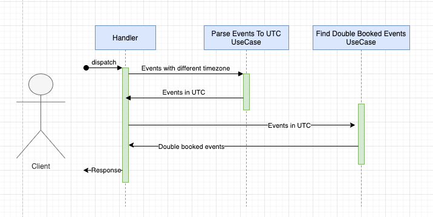
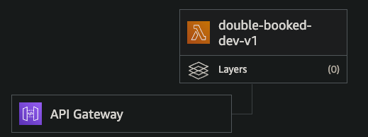
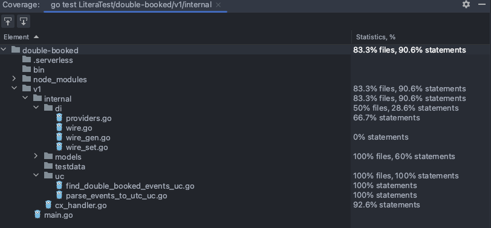
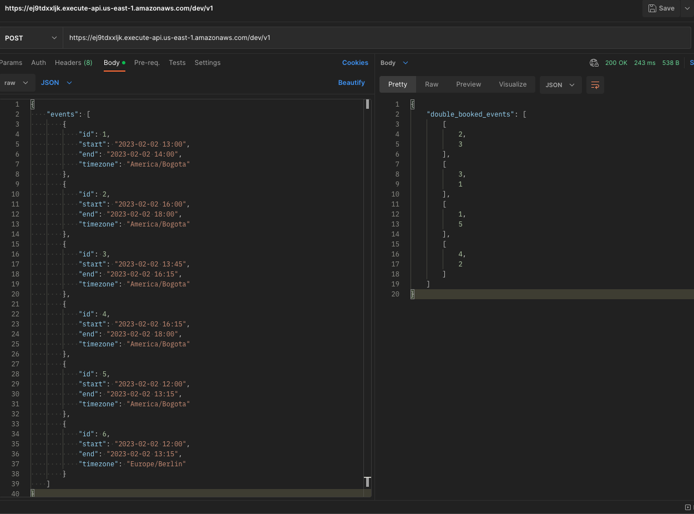
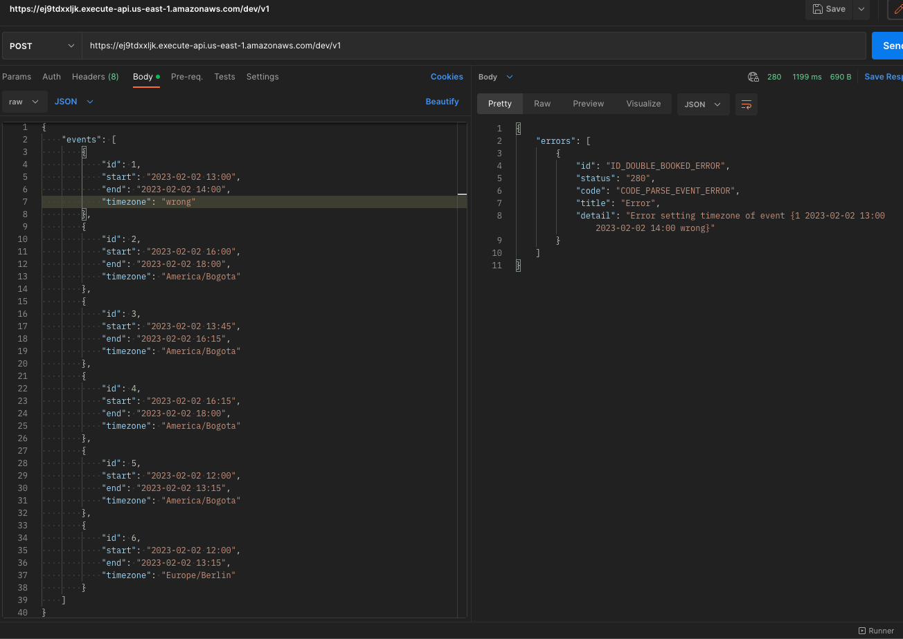
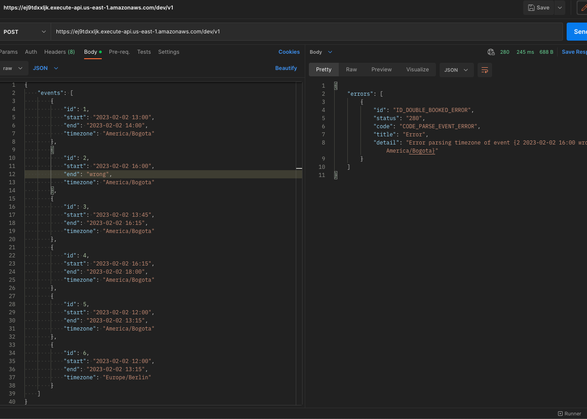

# Double Booked

When maintaining a calendar of events, it is important to know if an event overlaps with another event.
Given a sequence of events, each having a start and end time, write a program that will return the sequence of all pairs of overlapping events.

# Frequent questions

1.  "What format should be used for events?" A: Doesn't matter, the candidate's choice.
2.  "What format should be used to represent time? What about timezones?" A: Doesn't matter, the candidate's choice.
3.  "What are the expected inputs/outputs/interface?" A: Candidate's choice, they can simply provide some functions, or a CLI, or an interactive web application... All valid options, and it's interesting to see some of the creative choices people have made.
4.  "Should the outputs be like [1, 2, 3] or [[1, 2], [2, 3]]?" A: The latter, this is the "sequence of all pairs" part.

## My Solution

I decided to develop a web service whose input is a list of object-type elements where each element represents an event for the designed calendar and the response will be an array with the identifiers of the pairs of events that overlap. In this order of ideas, each event must have a unique identifier, a start time and an end time. To solve the issue of time zones I decided to add an extra field to the event called Timezone, here the user can add the time zone they want, the system must respect this for each of the events.

## Infrastructure (AWS Lambda & Serverless Framework)

I developed all my web service on the cloud using the serverless framework to deploy in AWS lambda, this with the aim of demonstrating my knowledge in the cloud, as well as in this way the judge can consume the service from anywhere he wants. This without counting all the advantages that serverless development provides us.

## Automation with Make

Additionally, I made a simple automation using make where anyone with access to the repository can compile and deploy the developed lambda function by running the "make dev" command and previously having AWS credentials configured on their machine.

## External libraries used

I used 4 external libraries to carry out good practices throughout the development of my test, the first 2 (aws-lambda-go and aws-sdk-go) are part of the AWS SDK and allow the configuration of the code to be able to deploy on the cloud.
Another helpful library for good practices used was wire, which allows us to inject dependencies into the code.
In addition, I also used testify for the development of unit tests.

## Architecture used

I decided to use Clean Architecture for my development where I encapsulated my logic in different layers, this guarantees the independence of all my classes, a good code structuring, logic decoupling and ease of testing.


# My Solution

I wanted my solution to the problem to be simple and fast, in addition to taking into account all the flows that it could have. In summary, once I receive the request through the POST method, I validate the fields using JsonSchema to be able to convert each of the events to the UTC time zone. This way no matter what time zone any event has, we will have an accurate calculation for couples that overlap with events on the calendar.
Once the events have been standardized, I proceed to calculate the events that overlap each other, for this I carried out a parallel process in which I evaluate all the events at the same time to obtain the pairs that overlap, I also tried to be very careful with those pairs that were repeated, excluding them from the final result.
At the end of the whole process, the response is shown to the end user in the way suggested in the test

## Unit tests

I carried out the respective unit tests for all the files of my code, achieving a coverage of +90%, testing all the flows that had to do with the logic of my application following good practices.

## Functional tests

I carried out the respective functional tests using the Postman desktop program that facilitates this process for web services, within the code there is the respective collection to be able to be imported into the program.

# Contracts

## Request

POST request to: https://ej9tdxxljk.execute-api.us-east-1.amazonaws.com/dev/v1
```json  
{
  "events": [
    {
      "id": 1,
      "start": "2023-02-02 13:00",
      "end": "2023-02-02 14:00",
      "timezone": "America/Bogota"
    },
    {
      "id": 2,
      "start": "2023-02-02 16:00",
      "end": "2023-02-02 18:00",
      "timezone": "America/Bogota"
    },
    {
      "id": 3,
      "start": "2023-02-02 13:45",
      "end": "2023-02-02 16:15",
      "timezone": "America/Bogota"
    },
    {
      "id": 4,
      "start": "2023-02-02 16:15",
      "end": "2023-02-02 18:00",
      "timezone": "America/Bogota"
    },
    {
      "id": 5,
      "start": "2023-02-02 12:00",
      "end": "2023-02-02 13:15",
      "timezone": "America/Bogota"
    },
    {
      "id": 6,
      "start": "2023-02-02 12:00",
      "end": "2023-02-02 13:15",
      "timezone": "Europe/Berlin"
    }
  ]
}
```
## Responses
### 200 HTTP OK
```json  
{
  "double_booked_events": [
    [
      2,
      3
    ],
    [
      3,
      1
    ],
    [
      1,
      5
    ],
    [
      4,
      2
    ]
  ]
}
```
```json 
{  
    "double_booked_events": []  
}
```
### 280 HTTP Business Error
```json  
{  
    "errors": [  
        {  
            "id": "ID_DOUBLE_BOOKED_ERROR",  
            "status": "280",  
            "code": "CODE_PARSE_EVENT_ERROR",  
            "title": "Error",  
            "detail": "Error setting timezone of event {1 2023-02-02 13:00 2023-02-02 14:00 WRONG}"
        }  
    ]  
}
```
```json  
{  
    "errors": [  
        {  
            "id": "ID_DOUBLE_BOOKED_ERROR",  
            "status": "280",  
            "code": "CODE_FIND_DOUBLE_BOOKED_ERROR",  
            "title": "Error",  
            "detail": "Error parsing timezone of UTC event {1 2023-02-02 18:00 2023-02-02 19:00 UTC}"
        }  
    ]  
}
```
### 500 Internal Server Error (Unexpected errors)
```json  
{  
    "errors": [  
        {  
            "id": "ID_GENERAL_ERROR",  
            "status": "500",  
            "code": "CODE_GENERAL_ERROR",  
            "title": "Error",  
            "detail": "Unexpected error"
        }  
    ]  
}
```

## Diagrams





## Evidences





## How to deploy

To deploy the application it is necessary to have AWS CLI installed and configured on your computer along with node JS 
to run the latest version of the serverless framework. Once this is done please clone the repository on your computer 
and in a terminal located at the root of the project please run the command: 
```make 
make dev
```
 this will perform the deployment 
automatically and expose a valid endpoint to be able to interact with the API without any issue.

# Author

Viviana Arango Grisales ✌🏻